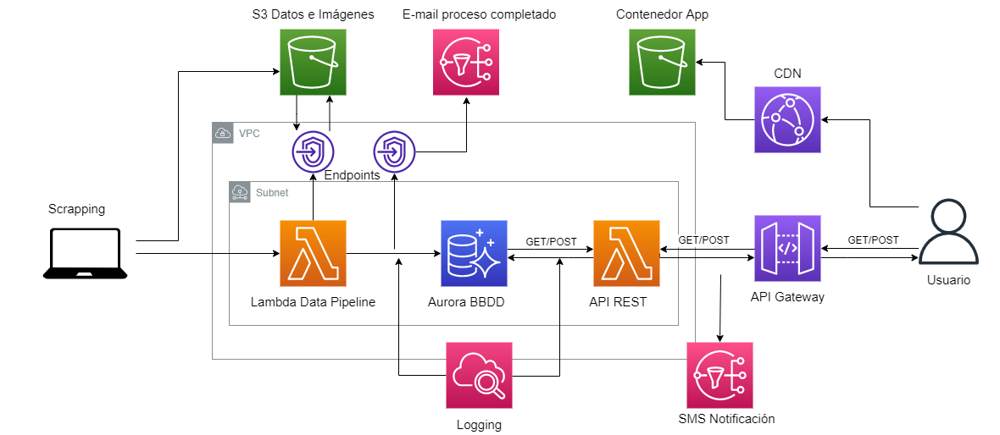

# Interprice
Master's research project about hyperautomation of processes and user interaction. The aim of this project is to build a cross-platform application for supermarket purchasing management from end to end. The ideas is to build a database with scraped data from different supermarkets e-commerce sites and end up with the deployment of the client frontend.

# Structure of the project
The different parts of the whole application are divided into three folders, each one corresponding to a particular point/component of the overall architecture.

## Web Scrapping

As the used framework for this is Scrapy, the structure of this part is mainly given by the default scaffolding providede by the tool.
All the spiders are configured to retrieve data directly to a AWS S3 bucket and they can be launch by two different ways:

  - With the `scrapy crawl 'name_spider' -a 'n_pages=X'` where the argument of number of pages is optional. *You must be inside the supermarkets folder*
  - With the prepared launcher in case you want to start the process inside a Docker container

The extracted data are thumbnails and json files with different properties such as name of products, price, image urls, ingredientes, manufacturer and many others.

The settings are configured for a specific context, so it may be required to change some of the variables depending on what behaviour is expected.

*The spider scripts are developed according to the current supermarket pages, if there is a change in them can cause execution errors or some inconsistencies in the extrated data*

## Backend

FastAPI was the chosen framework to build an API REST, so again the structure followed is the one recommended in the official documentation.

Each file's name indicate clearly what is the purpose of the implemented functionality, so there is no big mistery

  - The database is MySQL, so the connection with it is handled with SALAlchemy
  - All the CRUD operations are available in a single file, just like the Pydantic Schemas
  - The routes handling is separated in different categories
  - The CORS middleware is the basic one for a development stage, not ready for production
  
In order to deploy the API as Lambda function in AWS there is *yml* file in which the required configuration is declared according to the Serverless Framework standard. However, it also can be launched as a server with `uvicorn` in a local machine or in a Docker container.

## Frontend

To develop the client app quickly, Vue in combination of Ionic was used. Once more, the subfolder structure followed is a conventional one. 

Other Node modules used worth to be mentioned are axios for making request to the API, Pinia for the state management of the app and ChartJS to create the product price history.

  - All the own components are made of the combination of Ionic ones
  - There are different stores to manage the state: catalog, comparative list and shopping cart
  - A wrapper for the API was build just to simplify code
  - The views are not at all well optimized for every kind of device

The app was compiled with `npm run build` to convert it in a static web and then upload it to a AWS S3 bucket. In case you want to launch it locally, it can be done with `npm run serve`

# AWS architecture

The entire deployed infrastructure can be visualized on the following figure.

The data web scrapping is performed locally due to some restrictions and all the extracted data is stored in S3 bucket. One finished the scrapping a Lambda function is launched and it has the role of a pipeline storing the data into a Aurora BBDD. Once the pipeline function has finished, a notification is send with *information* about how the process has gone. There are also available execution logs in AWS CloudWatch. 

The second part of the architecture is the API REST represented as a Lambda function which handles requests from API Gateway. Meanwhile the users are connected through the app hosted in a S3 bucket, but distributed with AWS Cloudfront.

The deployment process has been made by two ways:
  - Serverless *yml* files, mainly for Lambdas definitions
  - AWS console for the creation of buckets, VPC managements or the creation of the BBDD due to its ease of use.

# Demo

Although the app is deployed in AWS, the credit for the student account is not unlimited so it is not possible to make it public forver. However, here you have a demo with a GIF of how the app works.

# Acknowledgments
This project as been developed under the tutorship of Ricardo Tesoriero Pszytula and José Antonio Gallud Lázaro, members of the Interactive System Engineering research group from University of Castilla La-Mancha.

